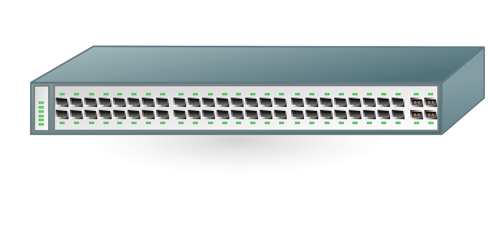

* 네트워크의 다양한 형태를 이해한다.
* 통신망 구성의 기본인 네트워크 접속 장치를 이해한다.
* 네트워크 접속 형태의 종류와 특징을 학습한다.
* 네트워크 전송 매체의 종류와 특징을 학습한다.
   

   
---   
# 01. 네트워크의 형태  
## 근거리 네트워크 (LAN)
근거리 네트워크(LAN: Local Area Network)란, 가까운 거리에 위치한 컴퓨터의 네트워크를 말한다. 유선 케이블, 적외선 링크, 무선 송수신기 등을 이용하여 통신한다.  
본 목차에서는 네트워크의 데이터 전송 원리와 서로 다른 유형의 네트워크의 데이터 공유 방법에 관해 공부해볼 것이다.
   
* 패킷(Packet): 네트워크를 이용하여 데이터를 한 컴퓨터에서 다른 컴퓨터로 전송하기 위해 작은 그룹으로 분할 된 데이터 전송 단위
* 패킷은 헤더(Header), 페이로드(Payload), 제어 요소 등을 포함하는 일종의 data segment다.
* 각 LAN은 특정한 Protocol(데이터를 송수신하는 일련의 규칙)로 운용된다.
   
## 캠퍼스 네트워크 (CAN)
캠퍼스 네트워크(CAN, Campus Area Network)는 LAN보다 더 크고 다양한 규모에서 사용된다.

## 광역 네트워크 (WAN)
광역 네트워크(WAN, Wide Area Network)는 두 개 이상의 LAN을 넓은 지역에 걸쳐 연결하는 것을 말한다. 예를 들어, 어떤 기업의 서울 본사와 지방의 생산 공장 간에 데이터와 프로그램을 공유하기 위해 기존 전화선에 라우터를 연결하여 광역 네트워크를 구성하기도 한다.  
먼 거리로 데이터를 전송하기 위해서는 광역 네트워크를 사용하는데, 보통 데이터 전송 설비를 임대하기에 비용이 많이 든다.

## 인트라넷 (Intranet)
인트라넷(Intranet)은 인터넷에서 사용하는 회선과 여러 기반 기술을 이용하여 구축하는 사설 네트워크를 말한다. 예를 들어, 각 지방에 분산된 대학 캠퍼스들을 연결하려고 할 때, 각 캠퍼스에서 가장 가까운 ISP까지만 연결하면 인터넷을 이용하여 저렴한 비용으로 사설 네트워크를 구축할 수 있다.
   
---  
# 02. 네트워크 접속 장치
네트워크 접속 장치는 통신망 구성에서 가장 기본이 되는 하드웨어다. 물리적으로 떨어져 있는 다양한 형태의 근거리 통신망을 연결하여 좀 더 복잡하고 큰 광역 통신망을 형성하기 위해서는 다양한 저복 장치가 필요하다.  
컴퓨터 네트워크 장치는 Network Interface Card를 이용해서 네트워크에 연결할 수 있다. 또한, 허브, 중계기, 스위치, 게이트웨이, 라우터 등을 이용하여 Networking 문제를 해결한다.  

## LAN 카드 (NIC, Network Interface Card)
* 두 대 이상의 컴퓨터로 네트워크를 구성하기 위해 외부 네트워크와 빠른 속도로 데이터를 송수신할 수 있도록 컴퓨터 내에 설치하는 확장 카드
* 전송 매체에 접속하는 역할과 데이터의 입출력 및 송수신, Protocol의 처리 기능 등을 담당
* 고유의 식별 코드, MAC 주소(Media Access Control Address): LAN 카드에 할당된 48비트의 물리적 주소

## 허브 (Hub)  
  
  
* 여러 대(세 대 이상)의 컴퓨터를 손쉽게 연결하는 장치
* 여러 개의 입력, 출력 포트가 있는 특수한 형태의 네트워크 장치. 한 포트에서 수신된 신호는 허브의 다른 모든 포트로 즉시 재전송되며, 모든 입력과 출력은 서로 연결되어 있어 여러 개의 노드가 똑같은 중계기를 공유할 수 있도록 해줌.
* 각 컴퓨터는 이더넷 케이블(UTP)를 사용하여 허브의 각 포트에 연결되고, 한 컴퓨터에서 다른 컴퓨터로 전송되는 컴퓨터가 허브를 통과한다. 허브는 수신되는 데이터의 소스나 의도한 대상을 식별할 수 없으므로 데이터를 보내는 컴퓨터를 비롯해 연결된 모든 컴퓨터에 데이터를 보낸다.    
### **Dummy hub**
데이터를 네트워크의 다른 컴퓨터로 전송한다. 단순히 컴퓨터 간의 네트워크를 중계하기만 한다.  
네트워크의 전체 대역폭을 노드 수만큼 분할하여 사용하므로 허브에 연결된 노드 수가 증가하면 네트워크 속도가 느려진다(Network Traffic).
### **Swtching hub**
전송 기능을 넘어, 수신지 주소로 switching(수신 측 주소를 읽어 그 주소의 단말기로만 데이터를 보내는 기능)하는 기능이 있고, 노드들을 각각 Point-to-Point로 접속시키므로 네트워크 효율이 높다.
### **Stackable hub**
스택 접속 포트가 갖춰진 허브로, 허브와 허브 사이를 연결하여 용량을 확장할 수 있다. 여러 대의 허브가 하나의 허브처럼 동작하므로 전송 속도의 차이가 적다.
### **Intelligent hub**
신호의 조절과 변경 등 다양한 지능형 기능을 포함한 허브. Network Managing System을 이용하여 데이터 제어와 분석이 가능하고, 충돌 발생시 충돌을 발생시킨 포트를 강제로 차단시켜 나머지 단말기는 문제 없이 통신이 가능하다.

## 스위치 (Swtich)

  
* 컴퓨터에 할당되는 대역폭을 극대화시켜주는 장치
* 근거리 통신망이 제공하는 대역폭을 모두 컴퓨터로 전송
* 수신하는 데이터의 의도한 대상을 식별할 수 있으므로, 데이터를 수신하기로 되어 있는 컴퓨터에만 해당 데이터를 보냄. 동시 송수신도 가능하므로 허브보다 빠른 속도로 데이터를 보낼 수도 있음.
