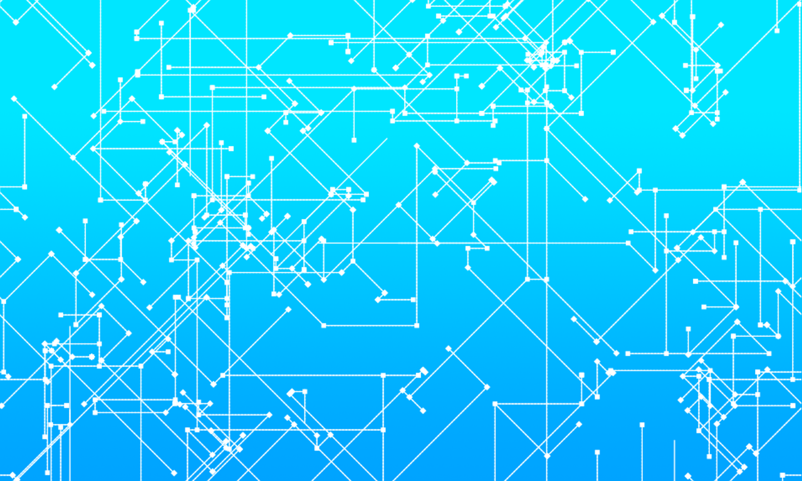

* 네트워크의 다양한 형태를 이해한다.
* 통신망 구성의 기본인 네트워크 접속 장치를 이해한다.
* 네트워크 접속 형태의 종류와 특징을 학습한다.
* 네트워크 전송 매체의 종류와 특징을 학습한다.
  
  

---   
# 01. 네트워크의 형태
## 근거리 네트워크
근거리 네트워크(LAN: Local Area Network)란, 가까운 거리에 위치한 컴퓨터의 네트워크를 말한다. 유선 케이블, 적외선 링크, 무선 송수신기 등을 이용하여 통신한다.  
본 목차에서는 네트워크의 데이터 전송 원리와 서로 다른 유형의 네트워크의 데이터 공유 방법에 관해 공부해볼 것이다.
   
* 패킷(Packet): 네트워크를 이용하여 데이터를 한 컴퓨터에서 다른 컴퓨터로 전송하기 위해 작은 그룹으로 분할 된 데이터 전송 단위
* 패킷은 헤더(Header), 페이로드(Payload), 제어 요소 등을 포함하는 일종의 data segment다.
* 각 LAN은 특정한 Protocol(데이터를 송수신하는 일련의 규칙)로 운용된다.
   
## 캠퍼스 네트워크
캠퍼스 네트워크(CAN, Campus Area Network)는 LAN보다 더 크고 다양한 규모에서 사용된다.